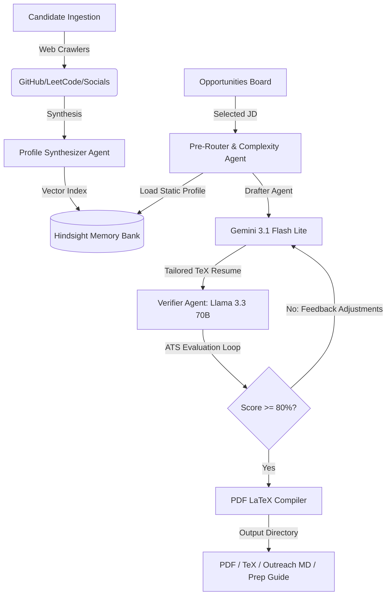

# CareerOS — Autonomous Multi-Agent Career Optimization Engine

CareerOS is an advanced, autonomous multi-agent developer command center designed to automate profile ingestion, resume tailoring, ATS evaluation loops, and outreach preparation. 

By leveraging a structured multi-agent architecture (Drafter and Verifier models), CareerOS crawls public data (GitHub commits, LeetCode, Codeforces, CodeChef), synthesizes candidate records into a Hindsight vector memory store, tailors LaTeX resumes to match job descriptions, runs ATS scoring feedback loops, and compiles print-ready PDFs.

---

## 🏗️ System Architecture & Multi-Agent Design

CareerOS runs a multi-agent orchestration pipeline configured via `cascadeflow` and Hindsight:



### 🤖 Core Agents
1. **Profile Synthesizer Agent**: Takes manual onboarding fields, crawled social metrics, and raw previous resume details, executing an LLM synthesis step to construct a structured Markdown candidate profile stored in the Hindsight Vector Memory.
2. **Commit Verification Agent**: Queries GitHub commits for each repo to verify actual authorship, filtering out template forks and imports.
3. **Complexity & Pre-Router**: Routes tasks dynamically to the most efficient model based on task complexity.
4. **Drafter Agent**: Tailors resume content using Google's **XYZ Bullet Formula** (*Accomplished [X], as measured by [Y], by doing [Z]*), selecting the most relevant projects and experiences matching the job description.
5. **Verifier Agent**: Computes the ATS match score, extracts key strengths, identifies missing requirements, and feeds improvements back to the Drafter for correction.
6. **TeX Compiler & Self-Correction Agent**: Compiles LaTeX files to PDF via API and scans compilation error logs to automatically self-correct layout issues.

---

## 🛠️ Technology Stack
- **Backend**: FastAPI, Python 3.10+, Uvicorn, Cascadeflow orchestration, Hindsight Memory Layer, Groq API, Google AI Studio.
- **Frontend**: Next.js 15+ (App Router), React 19, Tailwind CSS v4, Google Fonts (Outfit & JetBrains Mono).

---

## 🚀 Setup & Installation

### Prerequisites
Make sure you have the following installed:
- Python 3.10+
- Node.js 18+ & npm
- Git

---

### 1. Backend Setup (FastAPI)

1. Navigate to the `backend` directory:
   ```bash
   cd backend
   ```

2. Create a virtual environment and activate it:
   ```bash
   python -m venv venv
   # On Windows:
   .\venv\Scripts\activate
   # On macOS/Linux:
   source venv/bin/activate
   ```

3. Install required Python packages:
   ```bash
   pip install -r requirements.txt
   ```
   *(Ensure `cascadeflow`, `fastapi`, `uvicorn`, `groq`, `google-generativeai`, and `python-dotenv` are installed)*

4. Configure the Environment Variables:
   Create a `.env` file in the `backend/` directory:
   ```env
   GROQ_API_KEY=your_groq_api_key_here
   GEMINI_API_KEY=your_gemini_api_key_here
   HINDSIGHT_API_KEY=your_hindsight_api_key_here
   ```

5. Initialize the Simulated Jobs Database:
   Generate mock jobs (Machine Learning, Robotics, Software Engineering, etc.):
   ```bash
   python generate_jobs.py
   ```

6. Launch the backend API server:
   ```bash
   python main.py
   ```
   The backend API will start running on `http://localhost:8000`.

---

### 2. Frontend Setup (Next.js)

1. Navigate to the `frontend` directory:
   ```bash
   cd ../frontend
   ```

2. Install Node modules:
   ```bash
   npm install
   ```

3. Configure Environment Variables (Optional):
   By default, the frontend connects to `http://localhost:8000`. If your backend runs on a custom port, create a `.env.local` file:
   ```env
   NEXT_PUBLIC_API_BASE=http://localhost:8000
   ```

4. Launch the Next.js development server:
   ```bash
   npm run dev
   ```
   The frontend command console will start running on `http://localhost:3000`. Open it in your browser.

---

## 🖥️ Usage Guide

1. **Profile Ingestion**:
   - Go to the **Profile Ingestion** tab.
   - Fill in your basic details, add your crawler URLs (GitHub, LeetCode, Codeforces, etc.), paste your previous resume, and click **Sync & Synthesize Profile**.
   - Your synthesized factual profile will sync with Hindsight Cloud and render in the **Factual Memory** panel.

2. **Calibrate Jobs**:
   - Go to the **Opportunities Board** tab.
   - Filter jobs by category or search by skills/keywords.
   - Click **View Details** to inspect required competencies or click **Apply & Optimize** to launch the multi-agent pipeline.

3. **Monitor Live Pipeline**:
   - When optimization is triggered, the progress line will fill, indicating active agents.
   - The **Pipeline Terminal Output** logs real-time agent completions, reasoning, and compile diagnostics.

4. **Applications & Downloads**:
   - Go to the **Applications** tab.
   - Click **View Analysis & Output** to open the details panel.
   - Toggle **ATS Analysis** to check matching strengths and improvements.
   - Toggle **Resume Preview** to inspect a formatted document representation of the generated LaTeX.
   - Download compiled PDFs, TeX source codes, outreach email templates, and interview prep guides, or click **Overleaf** to edit the TeX code directly in your browser.

---

## 🔒 Security
- All sensitive variables, API keys, and credential tags are isolated in `.env` files.
- `.gitignore` is configured at the root level to prevent staging environment secrets, Python caches, and temporary build PDF/TeX outputs.
