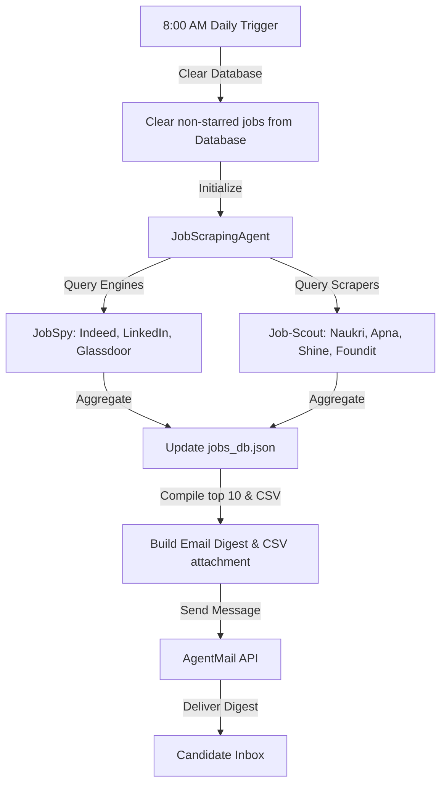
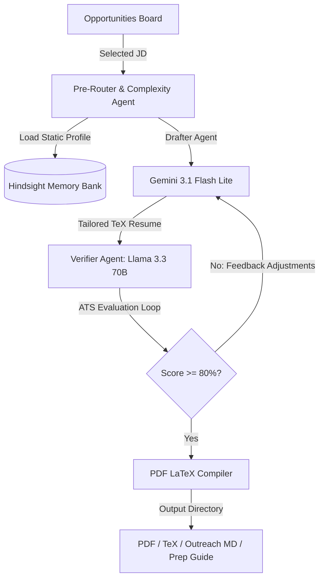

# CareerOS — Autonomous Multi-Agent Career Optimization Engine

CareerOS is an advanced, autonomous multi-agent developer workspace designed to automate profile ingestion, resume tailoring, ATS evaluation loops, outreach preparation, and interview readiness. 

Unlike traditional AI resume builders that only generate content after a manual prompt, **CareerOS works continuously in the background**. It discovers new opportunities daily, analyzes candidate eligibility, tailors job-specific application materials, and prepares interview questions, requiring only a few minutes of candidate review time rather than hours of manual labor.

👉 **[Download the CareerOS System Presentation PDF](CareerOS_Presentation.pdf)**

---

## 🎯 Core Objective & Target Audience

* **One Unified Goal**: To **maximize the user's probability of receiving interviews and offers**. Every agent in the system is aligned toward this single objective.
* **Target Audience**: College students, internship/job seekers, new graduates, and developers looking to streamline their application pipeline.

---

## 🏗️ System Architecture & Multi-Agent Design

CareerOS splits its runtime into two autonomous pipelines:

### 1. Automated Job Discovery & Daily Email Digest (08:00 AM Cron)
The background scheduler initiates daily at 8:00 AM to discover opportunities, filter them, and deliver a personalized digest:



### 2. Multi-Agent Resume Optimization & ATS Feedback Loop
When a candidate selects a job card and triggers **Apply & Optimize**, the system spins up the agent swarm:



---

## 🤖 Core Agents & Roles

1. **JobScrapingAgent**: Programmatically extracts search keywords based on your onboarding profile, queries all job boards concurrently, and saves fresh items to the local database.
2. **Profile Synthesizer Agent**: Runs on onboarding to crawl external developer platforms, verifying skills and generating a structured factual memory profile.
3. **Commit Verification Agent**: Crawls candidate GitHub repositories and evaluates git logs to verify actual code authorship, filtering out template forks and imports.
4. **Complexity & Pre-Router**: Dynamically evaluates the job description complexity and routes the processing steps to the most efficient LLM layout.
5. **Drafter Agent**: Formulates resume sections, choosing matching projects, and styling them using Google's **XYZ bullet formula** (*Accomplished X, measured by Y, by doing Z*).
6. **Verifier Agent**: Acts as an aggressive Applicant Tracking System (ATS), parsing the draft, generating an ATS score, and feeding corrections back to the Drafter.
7. **TeX Compiler Agent**: Self-corrects LaTeX compilation errors dynamically by parsing logs and rewriting layouts on the fly.

---

## 📂 Integrated Open-Source Repositories

CareerOS stands on the shoulders of the following open-source modules and engines:

* **[python-jobspy](https://github.com/cullenwatson/JobSpy) (JobSpy)**: A robust job scraper library used to query LinkedIn, Indeed, Glassdoor, and ZipRecruiter concurrently.
* **[job-scout](https://github.com/hitesh222/job-scout)**: Python crawler scripts leveraging Playwright to extract tech jobs and internships from regional portal interfaces (Naukri, Apna, Shine, Foundit).
* **[jobbot](https://github.com/hitesh222/jobbot)**: Automated resume compilation utilities, cover letter generation scripts, and headless portal apply automation.
* **[cascadeflow](https://github.com/Google/cascadeflow)**: Google's LLM orchestration framework used to route Drafter-Verifier agent execution.
* **[hindsight](https://github.com/Google/hindsight)**: A vector memory layer providing persistence and structured retrieval for the candidate's factual memory bank.

---

## 🛠️ Technology Stack

* **Backend**: FastAPI, Python 3.10+, Uvicorn, Playwright, Jinja2, urllib.
* **Frontend**: Next.js 15+ (App Router), React 19, Tailwind CSS v4, Lucide Icons, Outfit & JetBrains Mono Fonts.

---

## 🚀 Setup & Installation

### 1. Backend Setup (FastAPI)

1. Navigate to the backend directory:
   ```bash
   cd backend
   ```
2. Create and activate a virtual environment:
   ```bash
   python -m venv venv
   # On Windows:
   .\venv\Scripts\activate
   # On macOS/Linux:
   source venv/bin/activate
   ```
3. Install the dependencies:
   ```bash
   pip install -r requirements.txt
   ```
4. Install Playwright browser engines (required for Naukri, Apna, and Foundit scrapers):
   ```bash
   playwright install chromium
   ```
5. Configure Environment Variables:
   Rename `.env.example` to `.env` and fill in the required keys:
   ```env
   GROQ_API_KEY=your_groq_api_key_here
   GEMINI_API_KEY=your_gemini_api_key_here
   HINDSIGHT_API_KEY=your_hindsight_api_key_here
   AGENTMAIL_API_KEY=your_agentmail_api_key_here
   AGENTMAIL_INBOX_ID=your_agentmail_inbox_id_here
   ```
6. Generate the initial mock jobs database (optional):
   ```bash
   python generate_jobs.py
   ```
7. Start the backend server:
   ```bash
   python main.py
   ```
   The backend API will run on `http://localhost:8000`.

---

### 2. Frontend Setup (Next.js)

1. Navigate to the frontend directory:
   ```bash
   cd ../frontend
   ```
2. Install the node modules:
   ```bash
   npm install
   ```
3. Set up local environment variables (if your backend runs on a different port):
   Create a `.env.local` file:
   ```env
   NEXT_PUBLIC_API_BASE=http://localhost:8000
   NEXT_PUBLIC_SUPABASE_URL=your_supabase_project_url
   NEXT_PUBLIC_SUPABASE_PUBLISHABLE_KEY=your_supabase_key
   ```
4. Run the Next.js development server:
   ```bash
   npm run dev
   ```
   Open `http://localhost:3000` in your web browser.

---

## 🖥️ Usage Guide

1. **Profile Ingestion**: Enter your basic onboarding information and paste your GitHub, LeetCode, or LinkedIn profiles. CareerOS crawls your digital presence, filters template code, and synthesizes your Hindsight Memory.
2. **Opportunities Board**: View daily internships. Star the jobs you like. Starred jobs are preserved during daily cleanup runs.
3. **8:00 AM Daily Run**: The system wakes up at 8 AM, clears non-starred jobs, scrapes fresh leads, compiles the Top 10 matches, and sends you an email digest with an attached CSV sheet via AgentMail.
4. **Manual Run & Test Email**: Force a fresh scrape using the frontend trigger, or click the "Test Email" button to immediately receive your compiled spreadsheet without scraping again.
5. **Apply & Optimize**: Tailors a LaTeX resume matching the job using Drafter/Verifier feedback loops.
6. **Outreach & Prep**: Download your customized LaTeX code, PDF resume, connection templates, and behavioral interview preparation files.

---

## 🔒 Security
- All sensitive API keys and database parameters are kept in `.env` and `.env.local` files.
- Root `.gitignore` is pre-configured to ensure no secrets or local database caches are committed to your repository.
